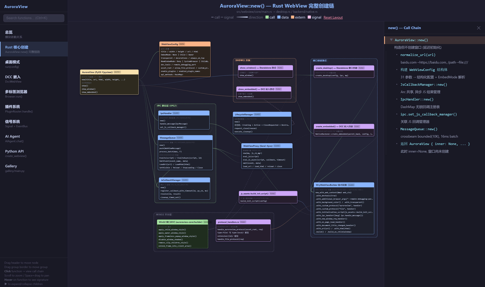
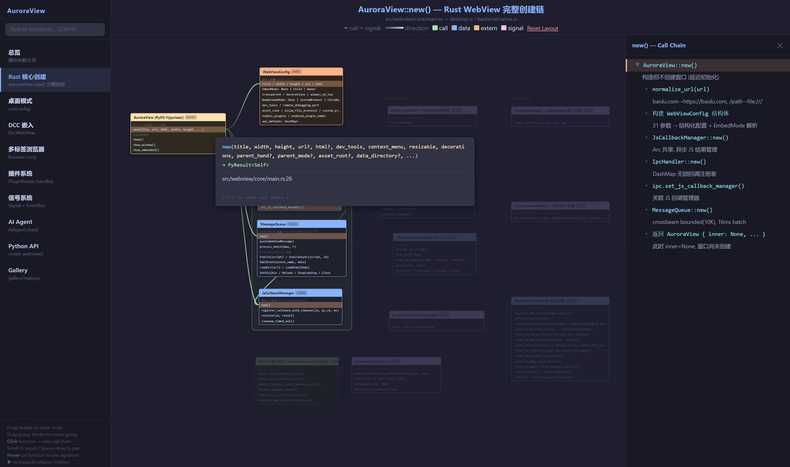
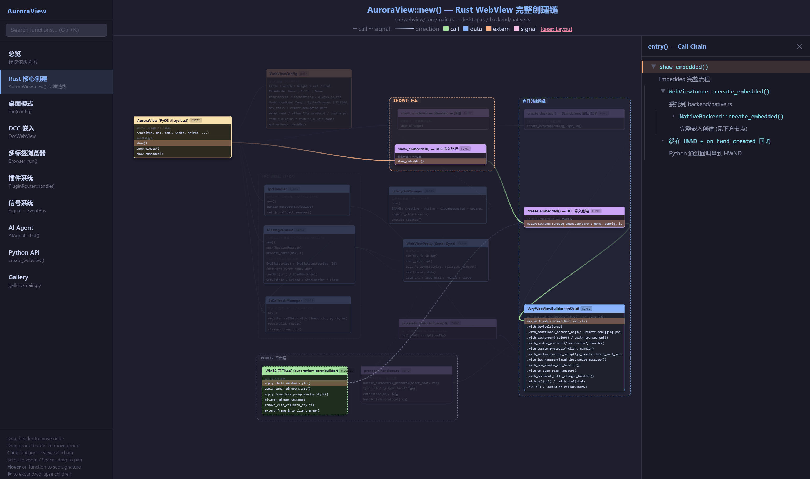

# Code Flow Graph

An interactive HTML node-graph viewer skill that visualizes codebase structure, entry-point call chains, and data type flows.

  

## Example — [AuroraView](https://github.com/loonghao/auroraview) Analysis

Below are screenshots from analyzing the [AuroraView](https://github.com/loonghao/auroraview) Rust WebView project:

### Full Call Chain Overview



*Complete `AuroraView::new()` call chain with all modules, IPC handlers, lifecycle management, and WebView builder — right-side panel shows the interactive call chain detail.*

### Function Signature Tooltips



*Hover over any function to see its full signature and source location. Click to highlight all connected relationships.*

### Entry Point Tracing



*Click `show_embedded()` to trace the DCC embedded entry flow — the viewer highlights the active path and dims unrelated nodes.*

## Features

- **Interactive Node Graph** — Draggable nodes with bezier-curve connections, pan & zoom
- **Call Chain Detail Panel** — Click entry-point functions to explore the complete call tree in a right-side panel
- **Global Search (Ctrl+K)** — Fuzzy search across ALL diagram pages with cross-diagram navigation
- **Multi-Diagram Support** — Organize views by entry-point call chains, UI layers, data types, and overview
- **Smart Highlighting** — Click any function to highlight its node + all connected relationships; dim everything else
- **Collapsible Children** — Sub-functions collapse/expand with connection redirect to parent
- **Signature Tooltips** — Hover functions to see full signatures, descriptions, and I/O
- **Position Persistence** — Node positions saved to localStorage per diagram
- **Catppuccin Mocha Dark Theme** — Beautiful dark color scheme with 12 semantic color classes

## How It Works

The viewer renders two files together:

| File | Purpose |
|------|---------|
| `code_flow_graph.html` | Rendering engine (do not modify) |
| `code_flow_graph_data.js` | Diagram data (generated per-project by your AI assistant) |

Simply place both files in the same directory and open the HTML in a browser.

## Installation

### As an Agent Skill

Copy the entire repository into your AI agent's skills directory:

```
<project>/.skills/code_flow_graph/
  SKILL.md
  assets/
    code_flow_graph.html
  references/
    data_format.md
```

Then ask your AI: *"Visualize the code architecture of this project"* or *"Generate a code graph for this module"*.

### Standalone Usage

You can also use the viewer independently:

1. Copy `example/code_flow_graph.html` to your project
2. Create a `code_flow_graph_data.js` file following the format in `references/data_format.md`
3. Open the HTML file in a browser

## Data Format

See [`references/data_format.md`](references/data_format.md) for the complete data format specification.

## Data Type Flow (Datatype Diagram)

The viewer supports a dedicated **datatype diagram** that traces how data structures flow through the codebase — from definition to transformation to consumption.

Each node in the datatype diagram represents a data class or type definition (peach color, auto-assigned by `type: 'data'`). Connections show how data flows between components:

| Connection Color | Meaning |
|-----------------|---------|
| 🔵 Blue | Data passed as input / output between functions |
| 🟢 Green | Data constructed or returned by a function |
| 🟠 Peach | Data consumed by an external dependency |

A typical datatype flow looks like:

```
[RawInput] ──construct──▶ [ParsedData] ──transform──▶ [ModelInput] ──consume──▶ [ExternalAPI]
```

To include a datatype diagram in your `code_flow_graph_data.js`:

```js
DIAGRAMS.datatypes = {
  title: 'Data Type Flow',
  sub: 'How data structures move through the system',
  navLabel: 'DataTypes',
  navSub: 'data flow',
  NODES: [
    {
      id: 'UserInput', label: 'UserInput', type: 'class',
      x: 30, y: 60, w: 240,
      sections: [{ title: 'Fields', attrs: [
        { id: 'UserInput.query', name: 'query: str' },
        { id: 'UserInput.lang',  name: 'lang: str' },
      ]}]
    },
    {
      id: 'ParsedRequest', label: 'ParsedRequest', type: 'class',
      x: 340, y: 60, w: 260,
      sections: [{ title: 'Fields', attrs: [
        { id: 'ParsedRequest.tokens', name: 'tokens: List[str]' },
        { id: 'ParsedRequest.intent', name: 'intent: str' },
      ]}]
    },
  ],
  CONNECTIONS: [
    ['UserInput.query', 'ParsedRequest.tokens', '#89b4fa', false],
  ],
};
```

## Color Scheme

Uses [Catppuccin Mocha](https://github.com/catppuccin/catppuccin) palette. Color is **automatically assigned by node type**:

| Type | Color |
|------|-------|
| `entry` | 🟡 Yellow |
| `class` | 🔵 Blue |
| `module` | 🟢 Green |
| `function` | 🟣 Mauve |
| `data` | 🟠 Peach |
| `widget` | 🩷 Flamingo |
| `slots` | 🩷 Pink |

> Nodes with `external: true` are rendered with dashed borders and an `EXT` tag to indicate third-party dependencies.

## Connection Types

| Color | Style | Meaning |
|-------|-------|---------|
| 🟢 Green | Solid | Direct function call |
| 🔴 Red | Solid | Inheritance / override |
| 🔵 Blue | Solid | Data flow |
| 🩷 Pink | Dashed | Signal / event / callback |
| 🟠 Peach | Solid | External dependency |

## Keyboard Shortcuts

| Key | Action |
|-----|--------|
| `Ctrl+K` | Open global search |
| `Escape` | Close search / detail panel |
| Click blank area | Clear all highlights |

## License

MIT
